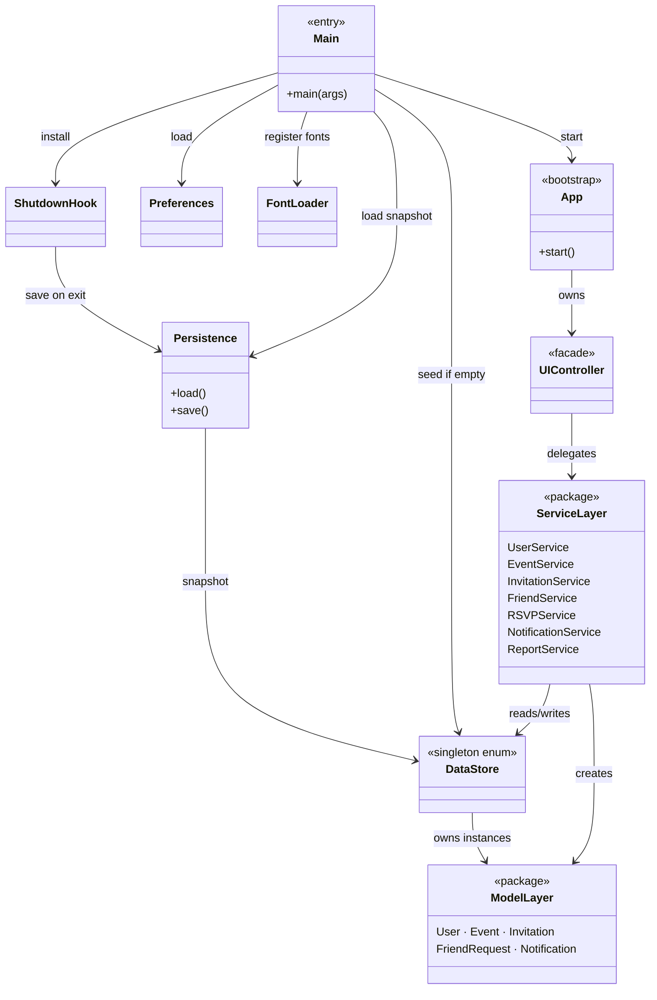
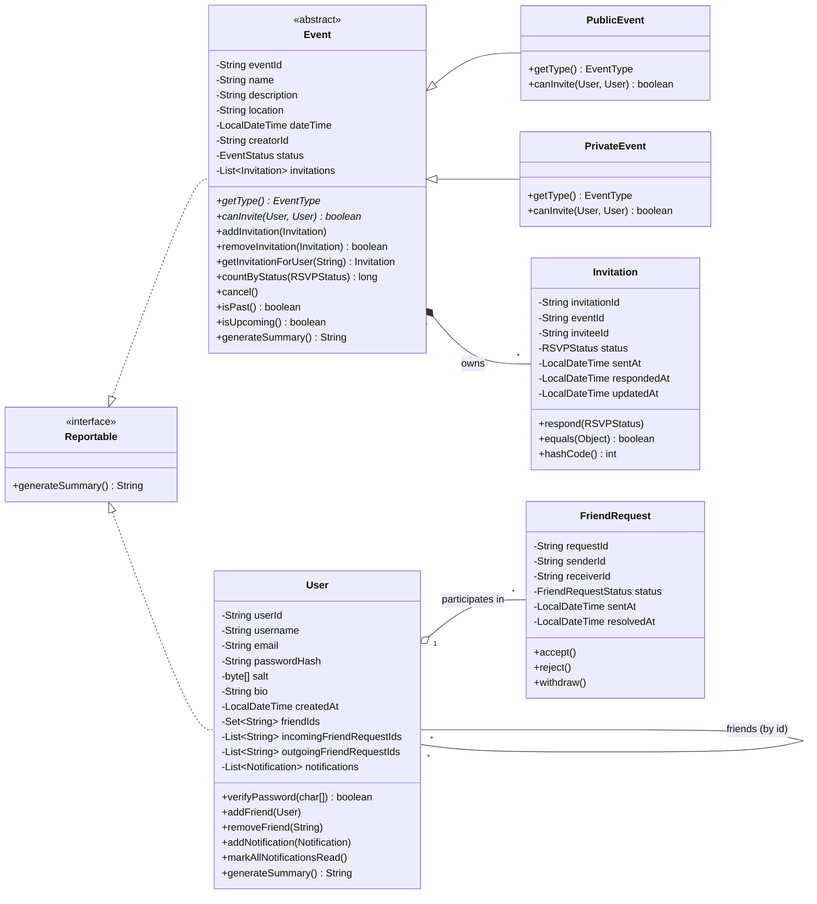
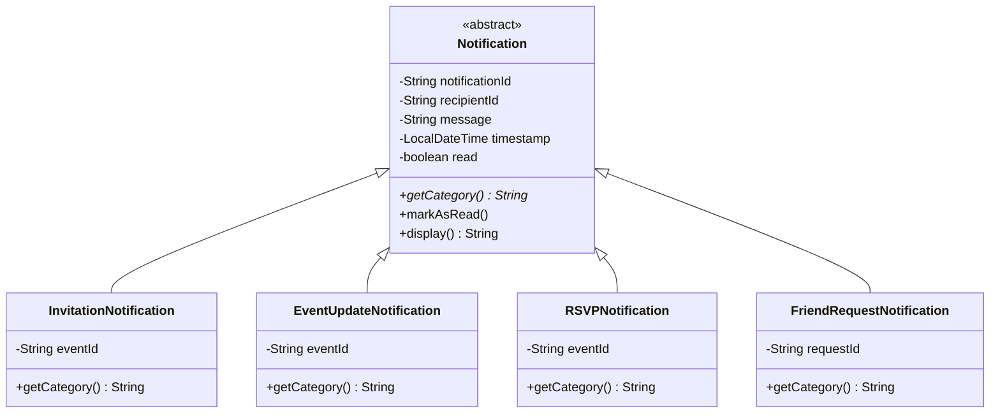
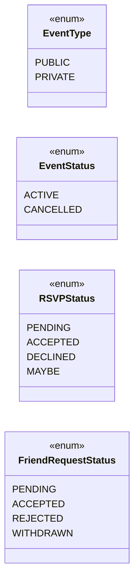
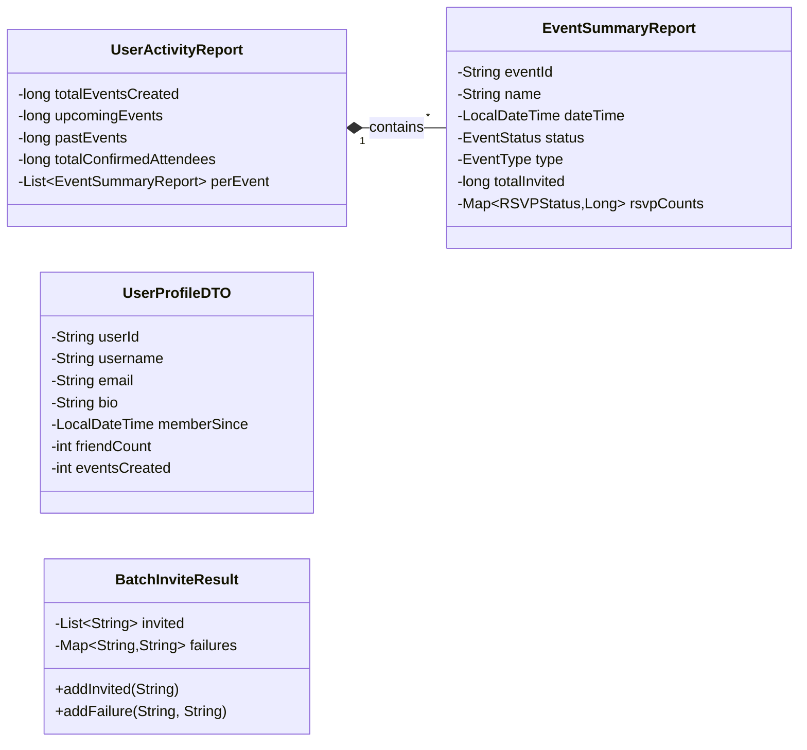
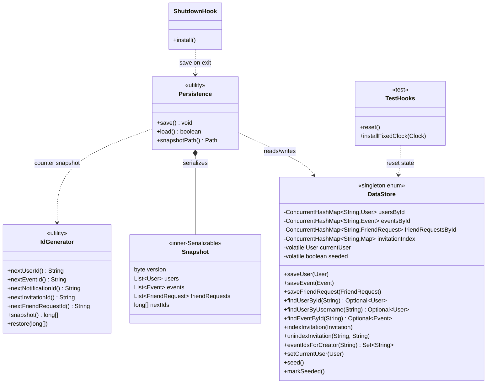
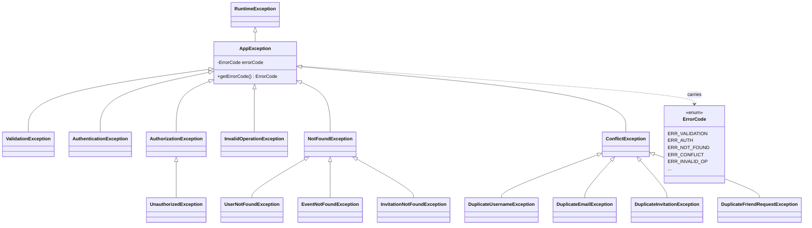

[README](README.md) • [UML Diagrams](UML.md)
  
# Event Organizer (Q7 — Social Media Event Organizer)

A Java desktop app that lets users register, manage their friends, create
public/private events, invite friends, RSVP, and read reports and notifications.
Built to showcase object-oriented design: every spec feature maps onto a
clear encapsulated model, abstract inheritance hierarchy, and polymorphic
dispatch. The UI is Swing + FlatLaf (dark theme); data lives in memory.

## Architecture

# Event Organizer — UML Class Diagrams

This document captures the full class structure of the Event Organizer
project as a set of focused UML class diagrams. Each diagram is rendered in
[Mermaid](https://mermaid.js.org/) syntax — GitHub, VS Code's Markdown
preview, and `mmdc` all render Mermaid natively.

The diagrams are split by concern so each one stays readable; together they
cover every class and relationship in the codebase.

| # | Diagram | Concern |
|---|---|---|
| 1 | [Architectural overview](#1-architectural-overview) | Package layout + dependency arrows |
| 2 | [Domain model — entities](#2-domain-model--entities) | `User`, `Event`, `Invitation`, `FriendRequest` and OOP relationships |
| 3 | [Polymorphic notifications](#3-polymorphic-notifications) | `Notification` abstract + 4 subclasses |
| 4 | [Enumerations](#4-enumerations) | The four enum types |
| 5 | [DTOs (report carriers)](#5-dtos-report-carriers) | Read-only reporting types |
| 6 | [Service layer](#6-service-layer) | Business-logic facades + their dependencies |
| 7 | [Persistence + DataStore](#7-persistence--datastore) | Singleton store, snapshot, ID generator |
| 8 | [Exception hierarchy](#8-exception-hierarchy) | `AppException` family used across layers |
| 9 | [UI controller seam](#9-ui-controller-seam) | How the Swing UI talks to services |

UML notation key (Mermaid `classDiagram`):

| Symbol | Meaning |
|---|---|
| `<|--` | inheritance (subclass → superclass) |
| `<|..` | interface implementation |
| `*--` | composition (lifetime owned) |
| `o--` | aggregation (lifetime independent) |
| `-->` | directional association / dependency |
| `..>` | dependency (uses but does not own) |
| `+` / `-` / `#` | public / private / protected member |
| `<<abstract>>` / `<<enum>>` / `<<interface>>` / `<<singleton>>` | stereotypes |

---

## 1. Architectural overview

A layered design with strict downward dependencies — the UI talks to a
controller, the controller talks to services, services talk to the
DataStore, and the DataStore talks to the model classes. Persistence + the
shutdown hook bracket the application lifecycle.



---

## 2. Domain model — entities

Core OOP relationships. `Event` is abstract with two concrete subclasses;
`PrivateEvent.canInvite` overrides the friends-only rule. `User` and `Event`
both implement the `Reportable` interface so the `ReportService` can treat
them uniformly.



Key OOP patterns visible here:

- **Inheritance + polymorphism:** `PublicEvent` / `PrivateEvent` override the
  abstract `getType()` and `canInvite()`. `EventService` works against the
  `Event` supertype; private-event invitation rules are dispatched at runtime.
- **Interface segregation:** `Reportable` lets `ReportService` treat heterogeneous
  classes (`User`, `Event`) uniformly without leaking persistence concerns.
- **Composite equality on `Invitation`:** `equals/hashCode` on `(eventId, inviteeId)` —
  enforced by `ModelInvariantsTest`.
- **Identity equality on `Event`, `User`, `FriendRequest`:** by primary id only.

---

## 3. Polymorphic notifications

The notification system is a textbook polymorphism example: one abstract
parent, four concrete subclasses, each with its own category label and
optional reference id (`eventId` or `requestId`). The UI's
`NotificationRow` renderer uses `getCategory()` to pick an icon + colour
without ever instanceof-checking.



---

## 4. Enumerations

Four enum types pin down the system's discrete states. They are
serializable and immutable; everything else in the model gates state
transitions through services.



---

## 5. DTOs (report carriers)

Pure data objects produced by `ReportService` and `InvitationService`.
They cross the controller seam by value — no domain mutation possible
through them.



---

## 6. Service layer

Seven services, each owning a single concern. They are stateless façades —
all state lives in `DataStore` — and they cross-call only through
`NotificationService` (which everyone uses to emit notifications).
`UIController` is the *only* outside caller; tests reach the services
directly.


---

## 7. Persistence + DataStore

`DataStore` is an enum singleton — guaranteed thread-safe init by the JVM
and trivial to mock via `TestHooks`. `Persistence` snapshots it via Java
serialization to a single file (`eventorganizer.data`) at JVM exit, then
loads it on next launch so accounts, events, invitations, and friendships
all survive between runs.



---

## 8. Exception hierarchy

A 3-level tree under `AppException`. Each leaf carries an `ErrorCode` so
the UI's single try/catch seam can map by code without string matching.
`UnauthorizedException` is the only 4-deep node — it specialises
`AuthorizationException` for "no current session" specifically.



---

## 9. UI controller seam

The Swing UI never touches `DataStore` or any service directly. Every UI
action funnels through `UIController`, which translates each call into a
service call. `Toast.error` at the call site catches every `AppException`
that bubbles up — that's the single error-handling seam for the entire
front-end.


---

## OOP design principles map

| Principle | Where it lives in the code |
|---|---|
| **Encapsulation** | All model fields are `private`; mutation only via setters that delegate to `Validator` (e.g. `Event.setLocation`, `User.updateProfile`). `passwordHash` and `salt` are read-only after construction except via `setPasswordHash`. |
| **Inheritance** | `Event ← PublicEvent / PrivateEvent`, `Notification ← {Invitation, EventUpdate, RSVP, FriendRequest}Notification`, exception 3-level tree. |
| **Polymorphism** | `Event.getType()` / `canInvite()` dispatched at runtime; `ReportService` treats `Reportable` uniformly across `User` and `Event`. `NotificationService` pushes any `Notification` subtype. |
| **Abstraction** | `Event`, `Notification` are abstract; `Reportable` is the lone interface. The UI talks only to `UIController` (façade), never to services or the store. |
| **Composition** | `Event` *owns* its `Invitation` list (lifetime-bound); `User` *owns* its `Notification` list. |
| **Aggregation** | `User` *references* friends by `userId` (lifetime-independent). `DataStore` aggregates all entities by id. |
| **Singleton** | `DataStore` is an `enum INSTANCE` — JVM-guaranteed thread-safe init. |
| **Façade** | `UIController` is the single entry point from the Swing layer to the seven services. |
| **Strategy** | `Easing` curves and `AuroraButton.Variant` (`DEFAULT`/`OUTLINE`/`GHOST`/`DANGER`) pick the rendering strategy per instance. |
| **Observer** | `Motion.addListener` lets `CanvasPanel` and `Constellation` pause their ambient timers the instant the user toggles reduced motion. |

---

## Rendering instructions

To regenerate these as PNG/SVG (e.g. for a written report):

```bash
# install once
npm install -g @mermaid-js/mermaid-cli

# render every code block in this file
mmdc -i docs/UML.md -o docs/UML.png
```


```
+-------------------------------------------------------------+
|  UI  (Swing + FlatLaf)                                      |
|  ui/App, ui/screens/{Auth,Dashboard,panels/...}, dialogs/   |
|                           |                                 |
|                           v                                 |
|  UIController  (single facade, 1 try/catch seam)            |
|                           |                                 |
|                           v                                 |
|  Services: UserService, EventService, InvitationService,    |
|            FriendService, RSVPService, NotificationService, |
|            ReportService                                    |
|                           |                                 |
|                           v                                 |
|  Models:  User, Event(PublicEvent/PrivateEvent), Invitation,|
|           FriendRequest, Notification + 4 subclasses, DTOs  |
|                           |                                 |
|                           v                                 |
|  Store:   DataStore (enum singleton; usernameIndex,         |
|           emailIndex, invitationIndex, friendRequestIndex)  |
+-------------------------------------------------------------+
```

Exceptions are unchecked and rooted at `AppException`; every service throws a
typed subclass on failure and the UI catches once at the screen seam and
surfaces a `Toast`. Time reads flow through `DataStore.INSTANCE.getClock()`
so tests can inject a fixed clock.

## Build / run / test

```bash
# Compile (Unix)
./build.sh
# Compile (Windows)
build.bat

# Launch the app
./run.sh    # or run.bat

# Run the JUnit 5 suite (68 tests)
./test.sh   # or test.bat
```

Dependencies vendored under `lib/`:
- `flatlaf-3.4.jar` (dark theme)
- `junit-platform-console-standalone-1.10.2.jar` (test runner)

No Maven / Gradle required. JDK 11+ is sufficient.

Seeded accounts (ready on first launch):
- `alice / alice123`
- `bob / bob12345`
- `carol / carol123`

The seed also populates cross-user state (pending friend request,
invitations, RSVPs) so every panel shows content on alice's first login.

## Spec features (7) → entry points

| # | Feature | Entry point |
|---|---|---|
| 1 | User registration / login / profile | `services/UserService.java` |
| 2 | Create / edit / cancel events | `services/EventService.java` |
| 3 | Send / accept / reject / withdraw friend requests | `services/FriendService.java` |
| 4 | Invite friends (public + private rules) | `services/InvitationService.java` |
| 5 | RSVP (accept / decline / maybe) | `services/RSVPService.java` |
| 6 | Notifications (4 kinds, cap + coalesce) | `services/NotificationService.java` |
| 7 | Reports (per-user activity + per-event summary) | `services/ReportService.java` |

## OOP principles

See [docs/OOP_EVIDENCE.md](docs/OOP_EVIDENCE.md) for a complete file:line map.
Highlights:

- `abstract class Event` with `canInvite` overridden by `PublicEvent` /
  `PrivateEvent` — polymorphic dispatch at `InvitationService.java:51`.
- `abstract class Notification` with 4 concrete subclasses, each supplying a
  `getCategory()`.
- `interface Reportable` implemented by both `Event` and `User`.
- `enum DataStore { INSTANCE; }` — the canonical singleton.
- 68 JUnit 5 tests (`test/com/eventorganizer/`) — all passing.

## Smoke test

See [docs/SMOKE_TEST.md](docs/SMOKE_TEST.md) for a 10-step UI smoke test.
