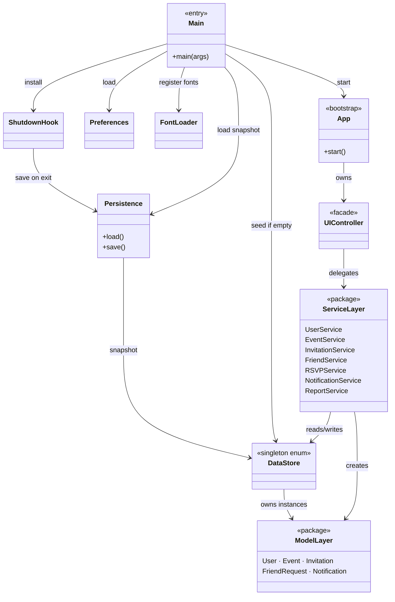
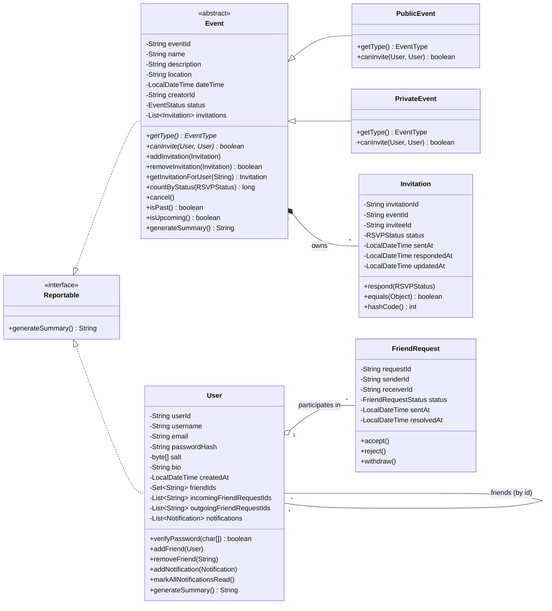
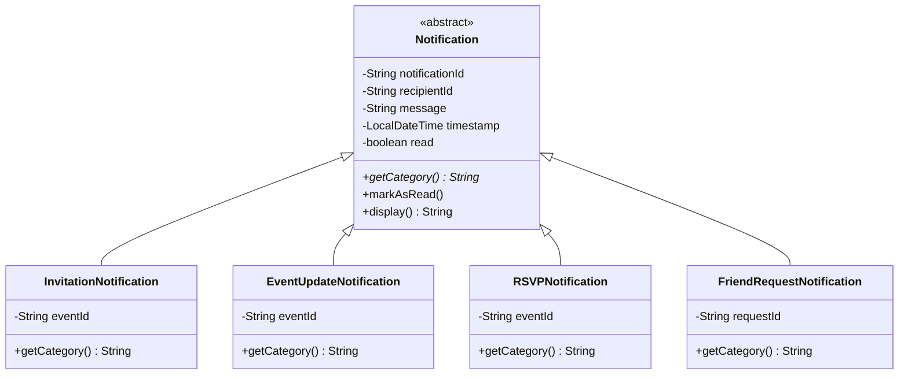
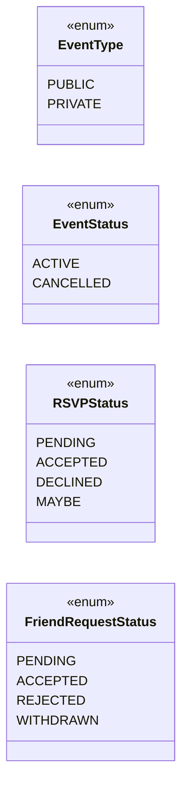
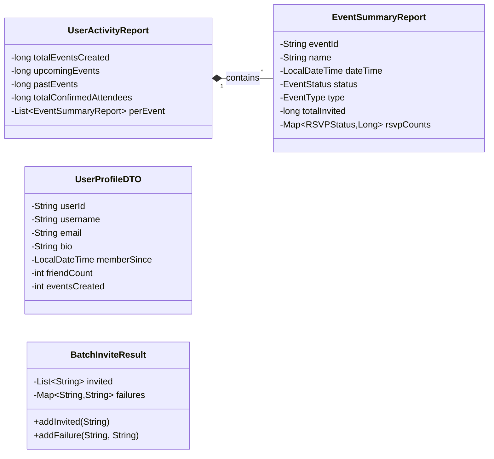
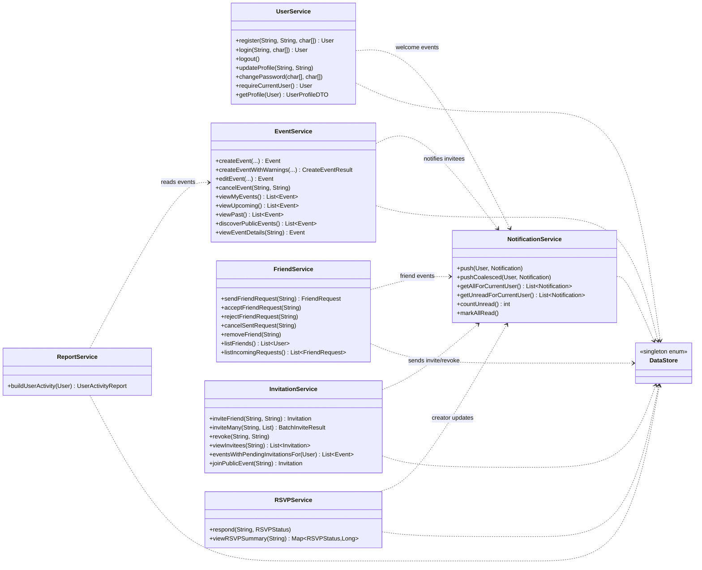
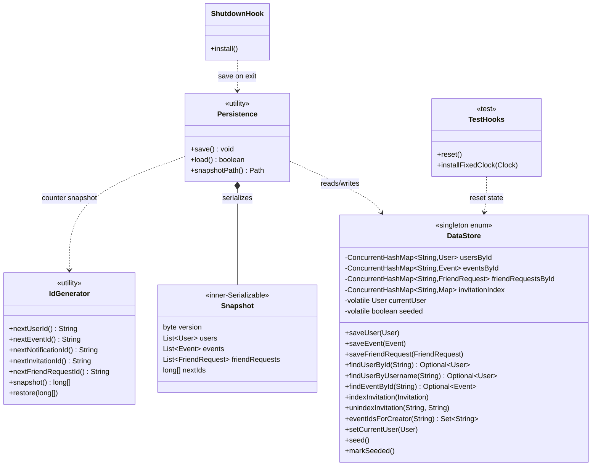
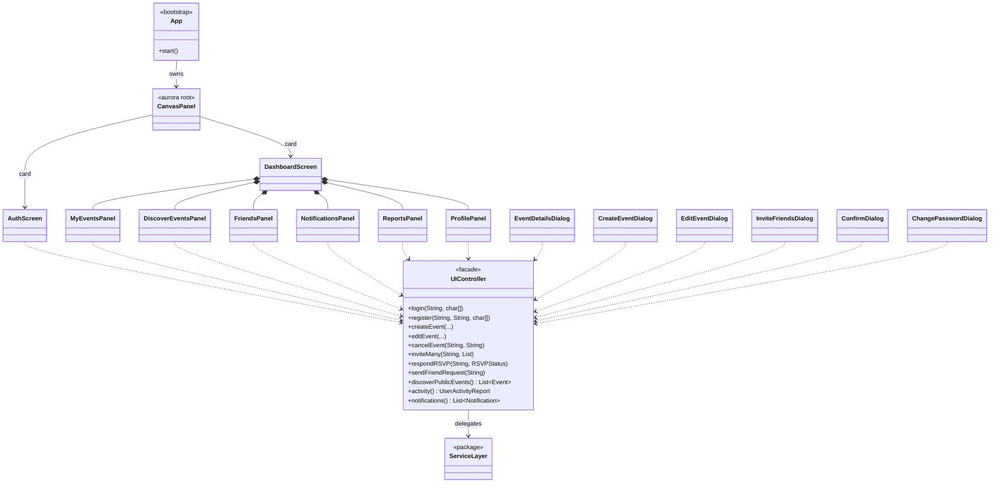

[README](README.md) • [UML Diagrams](docs/UML.md) • [Presentation](OOPs%20Project%20Presentation.pdf)

# Event Organizer

A Java desktop application I built for managing social events, friends, and
invitations. Users can register, create public or private events, invite friends,
RSVP, and view notifications and activity reports. The UI is built with Swing and
FlatLaf (dark theme) and all data lives in memory.

# Architecture

## UML Class Diagrams

The diagrams are split by concern so each one stays readable.

| # | Diagram | Concern |
|---|---|---|
| 1 | [Architectural overview](#1-architectural-overview) | Package layout + dependency arrows |
| 2 | [Domain model — entities](#2-domain-model--entities) | `User`, `Event`, `Invitation`, `FriendRequest` |
| 3 | [Notifications](#3-notifications) | `Notification` abstract + 4 subclasses |
| 4 | [Enumerations](#4-enumerations) | The four enum types |
| 5 | [DTOs (report carriers)](#5-dtos-report-carriers) | Read-only reporting types |
| 6 | [Service layer](#6-service-layer) | Business-logic classes + their dependencies |
| 7 | [Persistence + DataStore](#7-persistence--datastore) | Data store, snapshot, ID generator |
| 8 | [Exception hierarchy](#8-exception-hierarchy) | `AppException` family |
| 9 | [UI controller seam](#9-ui-controller-seam) | How the Swing UI talks to services |

---

## 1. Architectural overview

Shows how the main parts of the app are connected.



---

## 2. Domain model — entities

The main data classes and how they relate to each other.



---

## 3. Notifications

The four types of notification, each with its own category.



---

## 4. Enumerations

The four enums used across the app.



---

## 5. DTOs (report carriers)

Data objects used for reports.



---

## 6. Service layer

The seven service classes and their dependencies.



---

## 7. Persistence + DataStore

DataStore holds all the data. Persistence saves and loads it.



---

## 8. Exception hierarchy

Custom exception types used throughout the app.


---

## 9. UI controller seam

How the Swing UI talks to the service layer.



---

## How to Run

```bash
# Compile (Unix)
./build.sh
# Compile (Windows)
build.bat

# Launch the app
./run.sh    # or run.bat

# Run the JUnit 5 suite (68 tests)
./test.sh   # or test.bat
```

Dependencies vendored under `lib/`:
- `flatlaf-3.4.jar` (dark theme)
- `junit-platform-console-standalone-1.10.2.jar` (test runner)

No Maven / Gradle required. JDK 11+ is sufficient.

## Seeded accounts

The app comes with a few sample accounts ready to use on first launch:
- `alice / alice123`
- `bob / bob12345`
- `carol / carol123`

These accounts already have some cross-user state set up (a pending friend request,
invitations, RSVPs) so every panel shows content straight away when you log in as alice.

## Where to find the logic

The core business logic lives in `src/com/eventorganizer/services/`. Each service
handles one area of the app:

- `UserService` — registration, login, profile, and password changes
- `EventService` — creating, editing, and cancelling events
- `FriendService` — sending, accepting, rejecting, and cancelling friend requests
- `InvitationService` — inviting friends, revoking invites, joining public events
- `RSVPService` — responding to invitations (accept / decline / maybe)
- `NotificationService` — pushing and reading notifications
- `ReportService` — building activity and event summary reports

The UI talks to all of these through `UIController`, so the screens never access
the data store directly.

## Implementation Highlights

- I used an abstract `Event` class with two concrete subclasses (`PublicEvent` and
  `PrivateEvent`). Each one overrides the `canInvite()` method to enforce different
  invitation rules — private events only allow the creator's friends to be invited.

- I modelled notifications the same way: an abstract `Notification` class with four
  concrete types (`InvitationNotification`, `EventUpdateNotification`,
  `RSVPNotification`, `FriendRequestNotification`). The UI reads `getCategory()` on
  each one to pick the right icon, without ever checking which subclass it is.

- Both `Event` and `User` implement the `Reportable` interface, which lets
  `ReportService` generate summaries for either type without caring about the
  specific class.

- I chose to use an enum for `DataStore` so there is always exactly one instance of
  the data store running in the app. It saves and loads to a file (`eventorganizer.data`)
  on startup and shutdown, so accounts and events survive between runs.

- I included 68 JUnit tests in `test/com/eventorganizer/` that cover the model
  behaviour and service logic.
