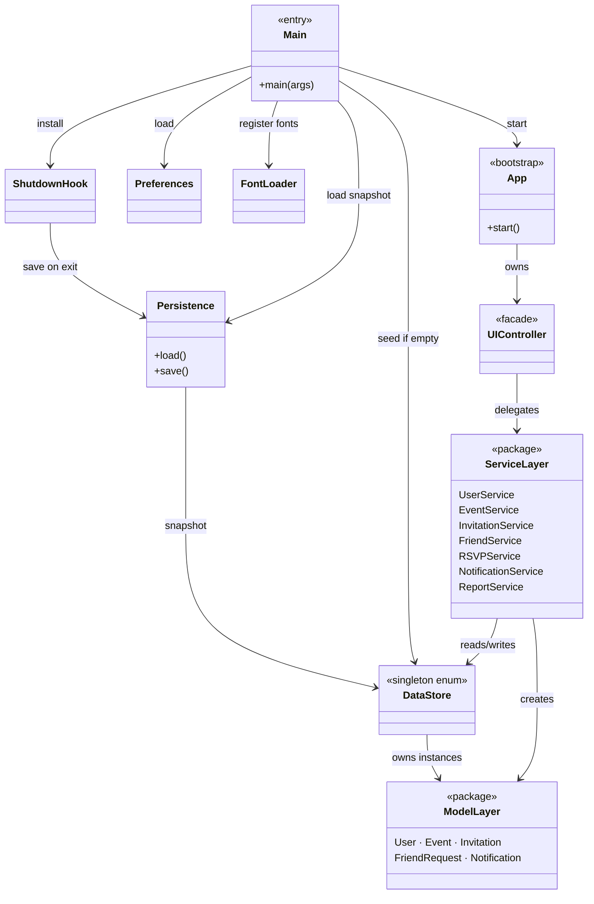
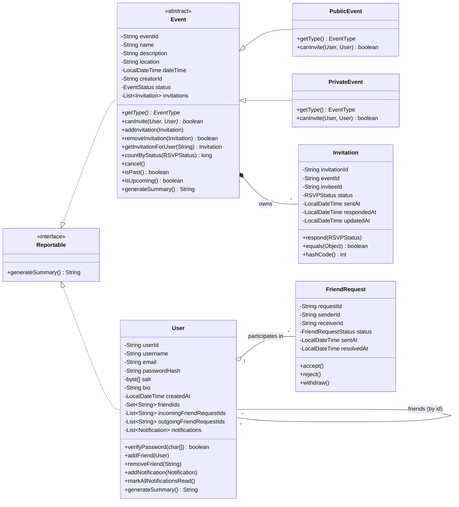
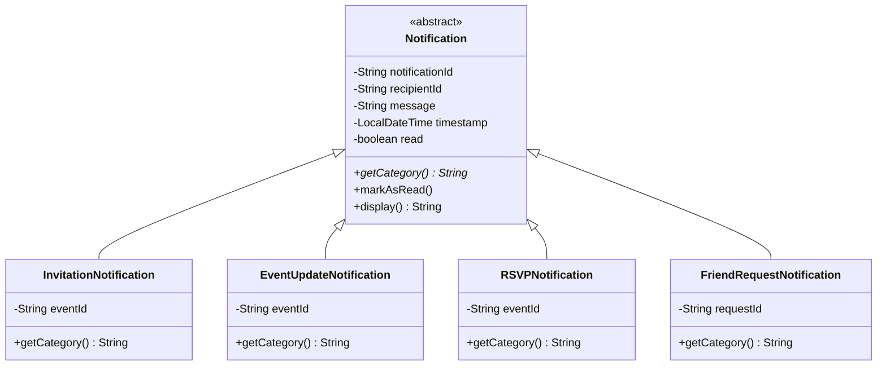
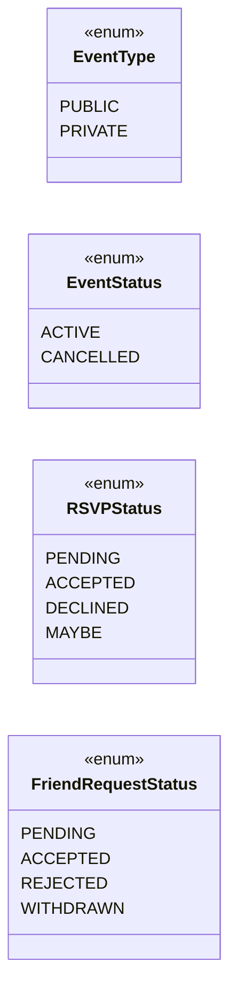
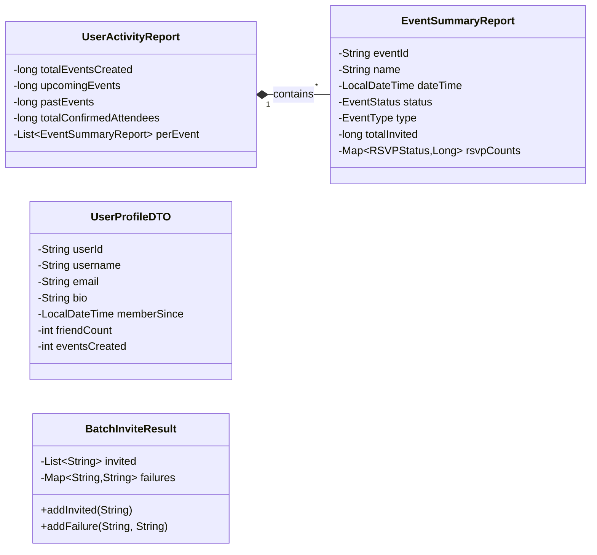
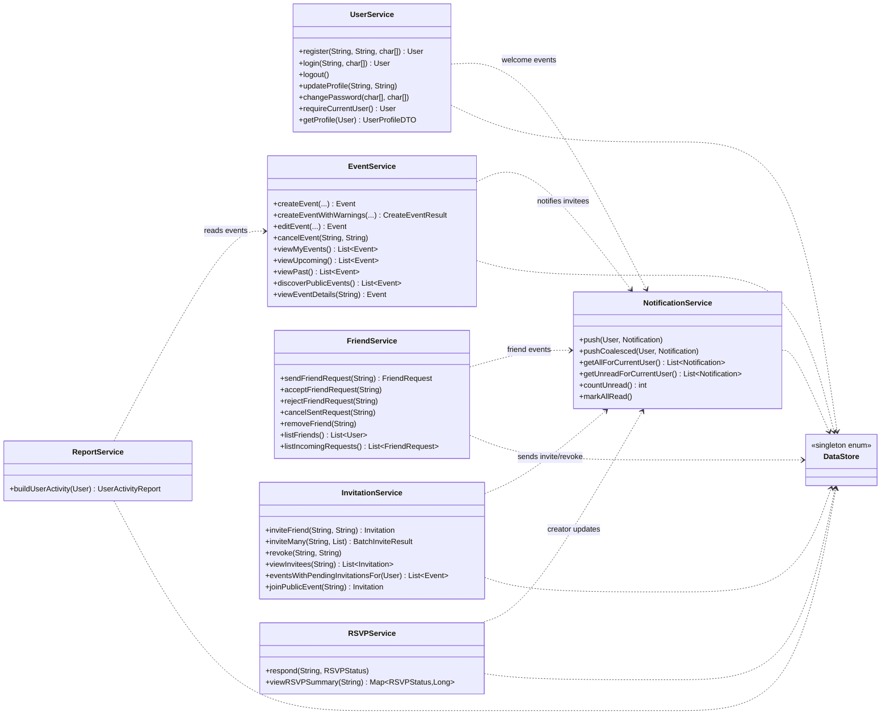
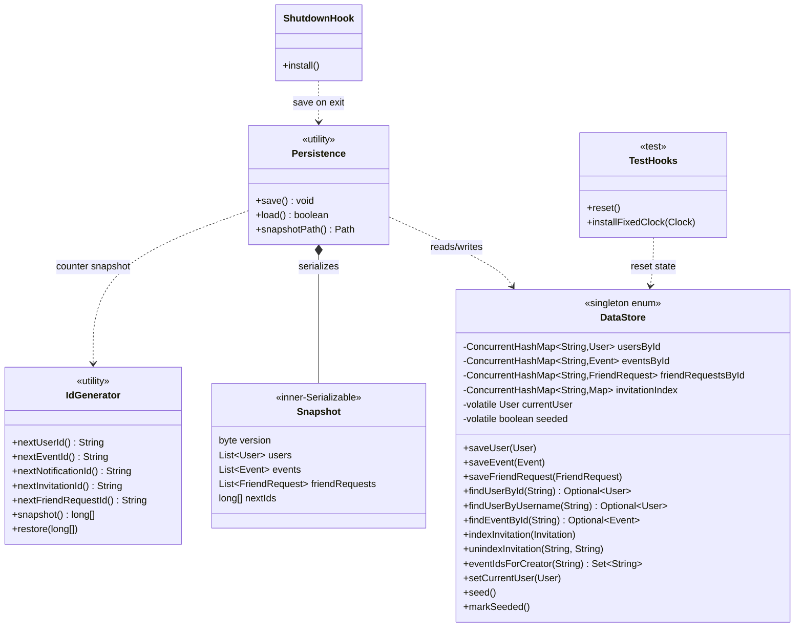
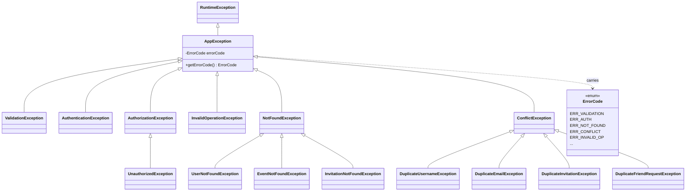
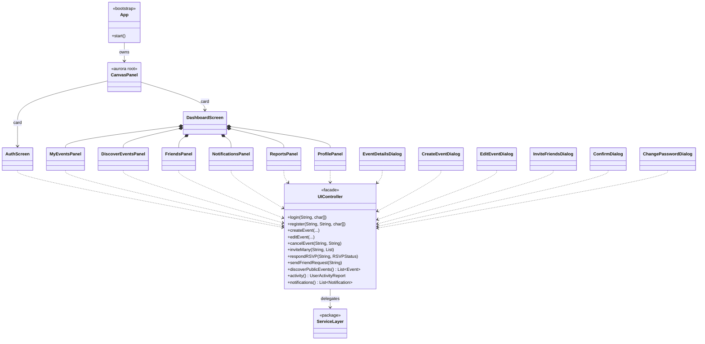

# Event Organizer — UML Class Diagrams

Class diagrams for the main components.

---

## 1. Architectural overview

Shows how the main parts of the app are connected.

---

## 2. Domain model — entities

The main data classes and how they relate to each other.

---

## 3. Notifications

The four types of notification, each with its own category.

---

## 4. Enumerations

The four enums used across the app.

---

## 5. DTOs (report carriers)

Data objects used for reports.

---

## 6. Service layer

The seven service classes and their dependencies.

---

## 7. Persistence + DataStore

DataStore holds all the data. Persistence saves and loads it.

---

## 8. Exception hierarchy

Custom exception types used throughout the app.

---

## 9. UI controller seam

How the Swing UI talks to the service layer.

